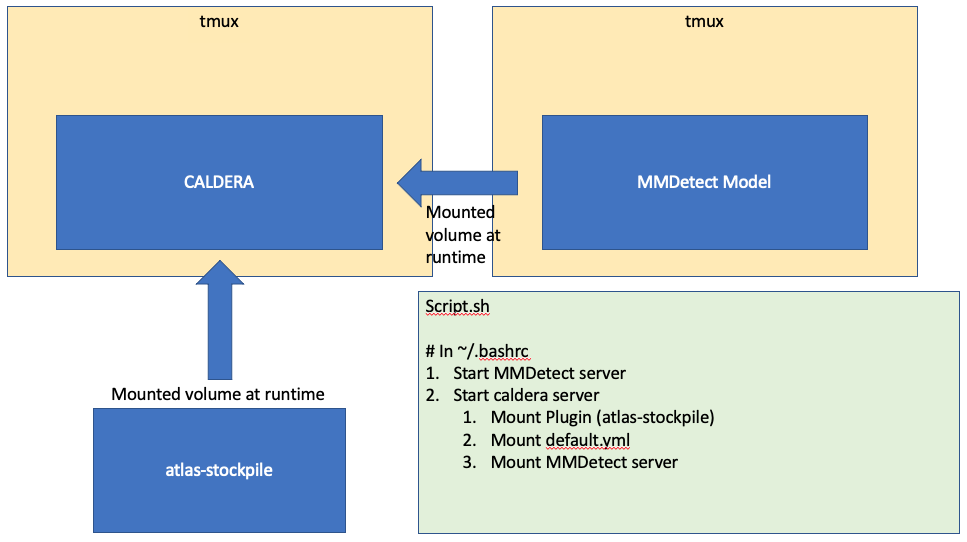

# ATLAS plugin: atlas-stockpile

### This plugin will help store and create adversarial TTPs defined in [`ATLAS`](https://atlas.mitre.org/) to interfeace with [`CALDERA`](https://github.com/mitre/caldera). It can be used in conjuction with the plugin [`Almanac`](https://gitlab.mitre.org/advml/almanac/-/tree/develop). This is a mirror of the public repo: [`stockpile`](https://github.com/mitre/stockpile/tree/master) on its `master` branch


- ## Do **NOT** push any code to `master` branch, this branch is reserved for pulling changes from the `stockpile` repo

- **All code relevant to `atlas-stockpile` that is not a development branch should be pushed to `main`**

# Developers
## Installation with CALDERA app

- follow guide for setting up the `atlas-stockpile` repo

### It is recommended to edit your `.bashrc` to instantiate a docker container with the `atlas-stockpile` plugin mounted to CALDERA container

To do so, run the following bash script, which will:

- install tmux
- edit `.bashrc` with the docker run command inside a persistent `tmux` session named "caldera"
- edit `.bashrc` with the docker run command inside a persistent `tmux` session named "mmdetect"

```code 
script.sh
```
## Mounting a different/additional plugin
### Mounting to the CALDERA docker container allows for dynamic changes to the plugin in the container to be seen.
### Be sure to clone the repo of the plugin you want to include into `/home/username/`

To mount other plugins not shipped with the CALDERA codebase simply add the following to the bash script and re-run:

```
-v /path/to/plugin:/usr/src/app/plugins/plugin
```

**Currently only the atlas-stckpile and almanac plugins are supported** 

# ATLAS-Stockpile Setup Help
To `fetch` new changes to the original stockpile repo:

```
# If you want, add the original repo as remote to fetch (potential) future changes. 
# Make sure you also disable push on the remote (as you are not allowed to push to it anyway)

git checkout master
git remote add upstream https://github.com/mitre/stockpile.git
git remote set-url --push upstream DISABLE

```

You can list all your remotes with:
```
git remote -v
```
You should see:
```
origin  git@gitlab.mitre.org:advml/atlas-stockpile.git (fetch)
origin  git@gitlab.mitre.org:advml/atlas-stockpile.git (push)
upstream        https://github.com/mitre/stockpile.git (fetch)
upstream        DISABLE (push)

```

**When you push, do so on origin with:**
```
 git push origin
 ```

 When you want to pull changes from upstream you can just fetch the remote and rebase on top of your work:
 ```
  git fetch upstream
  git rebase upstream/master

 ```

 Overview of how this code base works:



# CALDERA plugin: Stockpile

A plugin supplying CALDERA with TTPs and adversary profiles.

[Read the full docs](https://github.com/mitre/caldera/wiki/Plugin:-stockpile)

For collection and exfiltration abilities added January 2022 (see list below), additional information
for configuring these abilities can be found in the [examples](docs/Exfiltration-How-Tos.md) in the stockpile/docs/ 
folder.

*2022 Included abilities:*
- Advanced File Search and Stager
- Find Git Repositories & Compress Git Repository
- Compress Staged Directory (Password Protected)
- Compress Staged Directory (Password Protected) and Break Into Smaller Files
- Exfil Compressed Archive to FTP
- Exfil Compressed Archive to Dropbox
- Exfil Compressed Archive to GitHub Repositories | Gists
- Exfil Compressed Archive to GitHub Gist
- Exfil Directory Files to Github (this exfiltrates files without archiving)
- Exfil Compressed Archive to S3 via AWS CLI
- Transfer Compressed Archive to Separate S3 Bucket via AWS CLI
- Scheduled Exfiltration
