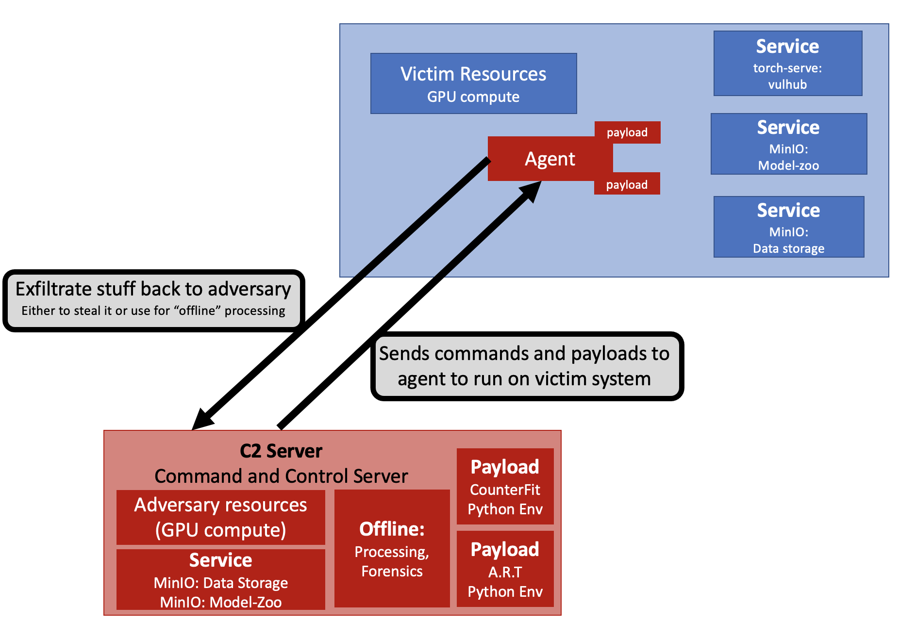

# Arsenal

## **Arsenal** is a Machine Leaerning (ML) plugin to the platform [`CALDERA`](https://github.com/mitre/caldera), that implements Tactics, Techniques, and Procedures (TTPs) specific to ML operations described in [`MITRE ATLAS`](https://atlas.mitre.org/).

### Arsenal implements modern ML libraries for adversarial ML development including:

 - Counterfit (link)
 - Adversarial Robustness Toolbox (ART) (link)

### Deployed using Docker via:
 - Vulhub (link)
 - torch-serve (link)
 - MinIO (link)

## Arsenal allows users to Red Team internal and external systems on a variety of pletforms (linux, windows, etc.) via CALDERA in conjunction with cybersecurity-based plugins and TTPs from MITRE ATT&CK (link).

There is a moderate amount of setup for a user to configure Arsenal for their own personal needs. Off the shelf Abilities and Adversaries are provided, and further instructions are provided for setting up:
-  individual model-zoo's 
-  data repositories

The following diagram illustrates the basic usage of the Arsenal plugin within CALDERA:

## Developers

If you are a developer and would like to contribute to Arsenal, please see our Gitlab. For intructions on setting up our development environment, please navigate to here (link).