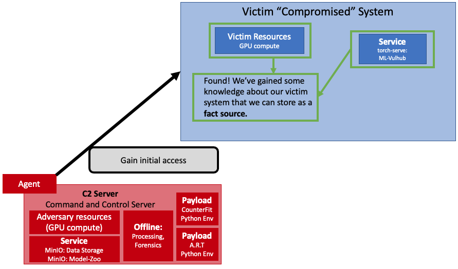
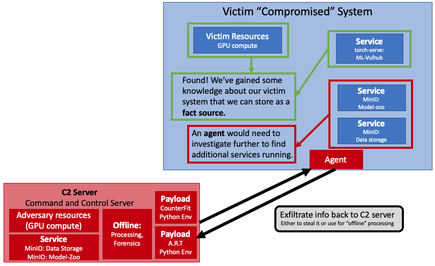

# Arsenal: Victim

Arsenal requires a victim system to attack (preferrably) hosting a machine learning algorithm.

However, hosting an algorithm is not required, an adversary may be interested in discovering hardware/compute capabilities of an adversary, exfiltrating data hosted on the system, etc. regardless of a hosted algorithm.

---

## Currently, `arsenal` uses the package [`ml-vulhub`](https://github.com/mitre-atlas/ml-vulhub) to deploy vulnerable environments. 
---

An example use-case that an adversary may encounter is levels of *access*. In `caldera` we can use the plugin `access` to first investigate a victim system before deploying an agent to that system.

For instance, an initial access agent, running from the Command-and-Control (C2) server could find that at a particular IP address the following services are running, which could inidicate a ML service is also on this vulnerable system:

However, to find additional resources or ML services, an agent would need to deployed on that vulnerable system.

